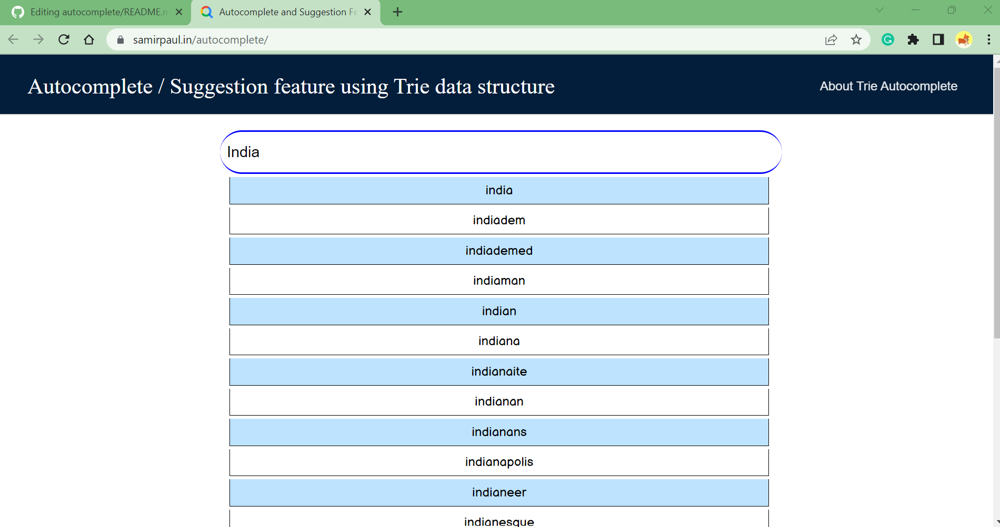

# Auto Complete

This projects implements the Trie Data Structure to create an autocomplete feature

## Table of contents

- [Overview](#overview)
  - [The challenge](#the-challenge)
  - [Screenshot](#screenshot)
  - [Links](#links)
- [My process](#my-process)
  - [Built with](#built-with)
  - [What I learned](#what-i-learned)
  - [Continued development](#continued-development)
- [Author](#author)

## Overview

- Live Demo:👇

- [x] [samirpaul.in/autocomplete](https://samirpaulb.github.io/autocomplete/)
- [x] [trieautocomplete.vercel.app](https://trieautocomplete.vercel.app/)
- [x] [autocomplete-search.pages.dev](https://autocomplete-search.pages.dev/)
- [x] [trie-autocomplete.netlify.app](https://trie-autocomplete.netlify.app/)

### The challenge

Users should be able to:

- Enter a word or partial word
- Recieve a list of words whose names start with the substring that they enter into the search bar

### Screenshot

### Links

- Solution URL: [https://github.com/SamirPaulb/autocomplete](https://github.com/SamirPaulb/autocomplete)
- Live Site URL: [https://samirpaul.in/autocomplete](https://samirpaulb.github.io/autocomplete)

## My process

### Built with

- Semantic HTML5 markup
- CSS custom properties
- Flexbox

### What I learned

I learned how the Trie data structure works and how it can be used to complete an auto complete feature. 

## Author

- [Samir Paul](https://samirpaulb.github.io)
